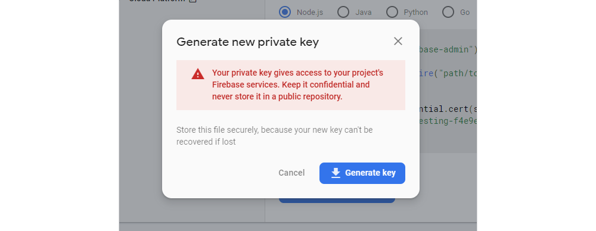
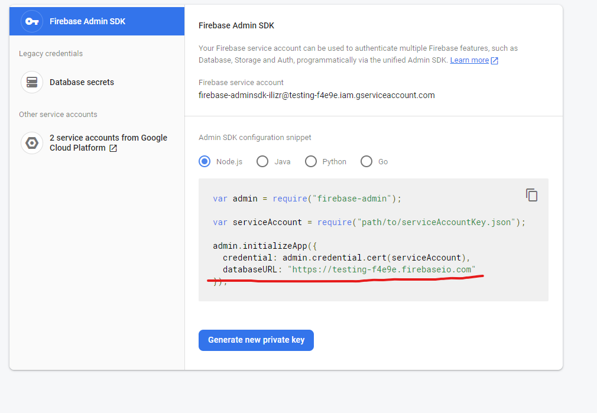

# SETUP FIREBASE ON FRONTEND: #

1.) login to https://firebase.google.com/ then click "Get Started".

2.) Create a project if you dont have one yet (can disable google analytics if you want).

3.) After successful creation, you'll be redirected to firebase console, there, you need to register your web app for the project.

    

4.) Now choose a name for your app.

    

5.) After your app has been added, you'll be given the config for your firebase app, which were going to store in our ENV file on the frontend directory.

    

6.) Next, we need to setup the firebase authentication, all you have to do is click Authentication, click "set up sign in method", click email/password, enable then save.

    
    
    
    

7.) Lastly, navigate to Users, then click Add User button, input their credentials then save, and that's it. Don't forget to update your ENV file.

    
    
    

# SETUP FIREBASE ON BACKEND: #

1.) Go to firebase console, select the project where you added your web app, on the upper left corner of the page, click the settings icon, and click "Project Settings".

    
    

2.) Navigate to Service Accounts tab, there, click "Generate new Private Key", then confirm that you have downloaded the json file.

    
    
    
    

3.) Now, open the backend directory, make sure youre in the Authentication branch if it's not yet implemented on the master branch, open the firebase folder, click credentials.json and replace its content 
    with the credentials of the json file you were given when you generated a new Private Key.

    
    

4.) And lastly, in your .ENV file, make sure you have the right value for FIREBASE_DATABASE_URL. This can be found on the Service Accounts Tab in Project Settings.

    
    

5.) That's it!! :)
